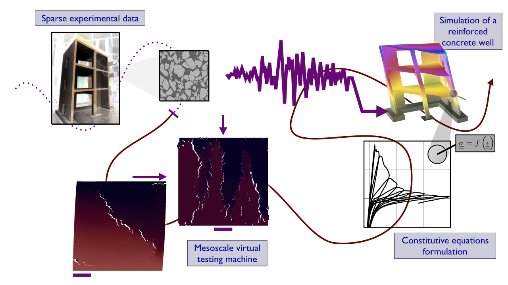

<!--
* decompose in three pages, accessed in header unfolding menu under projects

* or pop each of these pages from the figure on the main page

* contour separately science and devs parts on each topic

* recap links at bottom
-->

<!-- Let's go to the [science](#science) bit or the [devs](#devs) one... -->

## science
{: name="science"}

<!--  -->

Accurate simulation of massive reinforced concrete structures facing cyclic loading such as containment walls in nuclear power plants during a earthquake, requires precise and stable constitutive models that can be used jointly with finite element models. One of their key features is their ability to reproduce the amount of dissipated energy partly due to fracture and partly due to mechanisms associated to oscillatory loadings.

My PhD research focused on studying and modelling concrete at two-scales: the scale of a batch of concrete and the scale of an engineering structural element. I tried to understand and model the mechanical behaviour of concrete under cyclic loading, which is inherently complicated by the closure of cracks, causing gradual regain of stiffness, but most unexpectedly hysteresis.

**figure: a cracked wall**

Using a microscopic scale model for concrete, assuming homogeneity of the constituents but explicit description of cracking and partial representativity of cracks roughness, we have explored mechanisms related to cyclic loadings. Monitoring contact and friction in formed cracks in a few centimetres large piece of concrete, we have been able to understand how internal self-balanced pre-strains, released at cracking, can generate gradual stiffness recovery and hysteresis during unloading **cite: regul** .

<!-- <video src="../../static/cw38_amp10_better.avi" class="full-width"> -->
**figure: uniaxial behaviour vs. zoom on closing crack**

Well, that is set aside now, scale effects in fracture still have to be figured out.

## devs
{: name="devs"}

On the development side of things, which was most of my PhD allocation, I spent my time developing the microscale model of a batch of concrete. Originally it was an existing lattice model that I extended to a particle-based model, or as we call it now a beam-particle model **cite: beam-particle** . In short, the continuum is discretised using Voronoï tessellation, polygonal particles are initially linked by brittle beams, and upon their failure can interact further by contact and friction. To enhance numerical stability, which was severely impaired by the simultaneous integration of brittle failure, contact and friction, I also redesigned the solution algorithm to solve quasi-static equilibrium **cite: lattice**. The whole code is freely available on github **ref: github/deap** .

**figure: modelling methodology (add links to seism, deap, concyc, cast3m)**

Findings on the microscale mechanisms related to cracks closure led us to the formulation of a constitutive model for quasi-brittle materials cyclically loaded with enhanced numerical stability **cite: regul** . The model is now implemented **ref: concyc** and available in the open-source structural analysis and fluid mechanics software based on the finite element method developed at the CEA **ref: cast3m** .
